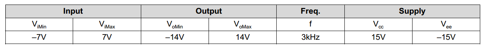
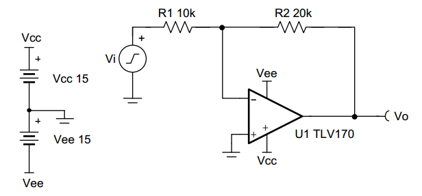
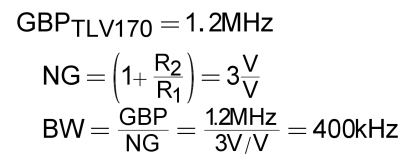
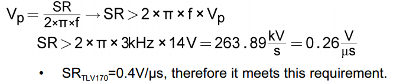
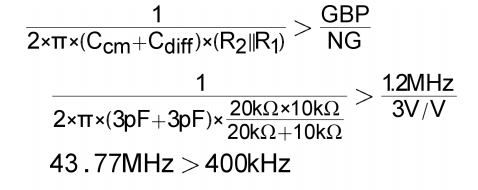
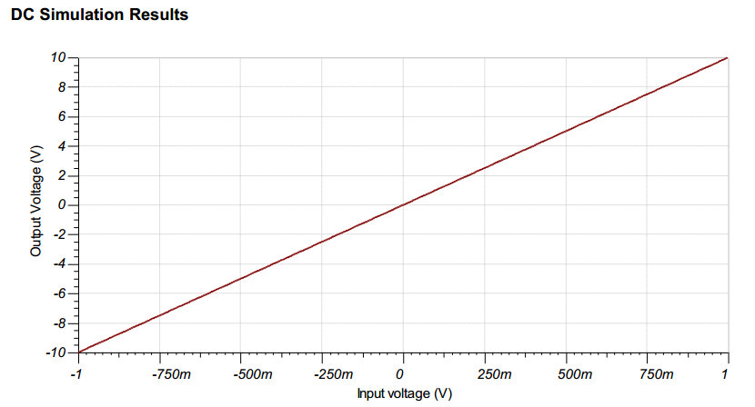
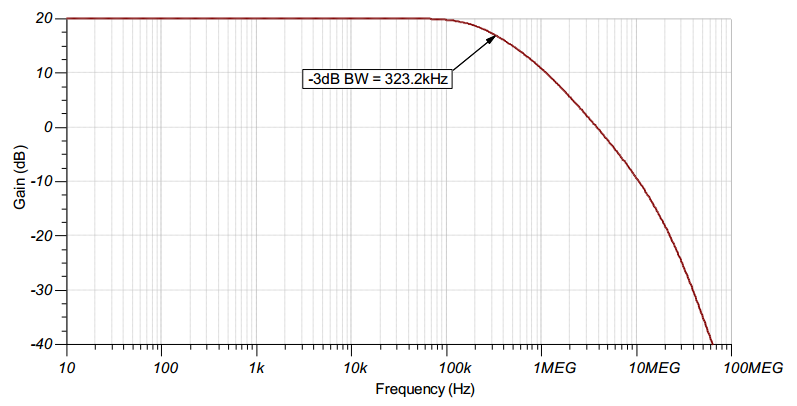

## 设计目标

---

## 设计概述

输入信号通常来自低阻抗，该电路的输入阻抗由R1决定。

---

## 设计笔记

1. 工作在线性区域，共模电压不随输入电压影响。
2. 输入阻抗由输入电阻确定，要确保输入电阻足够大。
3. 使用高阻值会降低电路的相位裕量，并在电路中引入额外的噪声。
4. 避免在输出接电容影响稳定性。
5. 小信号带宽由噪声增益（或同相增益）和运算放大器增益带宽积 （GBP） 决定。附加滤波可以通过与 R2 并电容来实现。如果使用高值电阻器，与 R2 并联添加电容器也会提高电路的稳定性。
6. 较大的信号性能可能受压摆率（SR）的限制。因此，检查数据手册中的最大输出幅度与频率，以尽量减少变频引起的失真。

---

## 设计步骤

Vout = -Vin(R2/R1)

1. 确定 R1 的起始值。R1 与信号源阻抗的相对大小会影响增益误差。假设信号源的阻抗较低（例如，100Ω），则设置 R1=10kΩ 以进行 1% 增益误差。
2. 计算电路所需的增益。Vout/Vin。
3. 计算R2=Vout/Vin。
4. 计算电路带宽，以确保它满足要求。请务必使用电路的噪声增益或同相增益。（增益带宽积）

5. 计算最小化摆位引起的失真所需的最小摆率。

6. 为了避免稳定性问题，确保增益设置的电阻和器件的输入电容产生的零点频率大于电路的带宽。

- Ccm和Cdiff分别是共模和差模的输入电容

---

## DC仿真结果

## AC仿真结果

