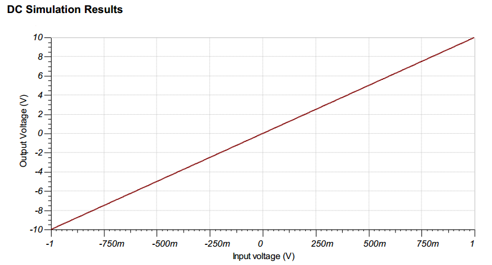

## 设计目标

---

## 设计概述

输入信号通常来自低阻抗源，该电路的输入阻抗由R1，R2决定。共模电压等于连接到同相端的电压，在此设计中，该节点是接地的。

---

## 设计笔记

1. 在线性工作区使用运放。线性输出摆幅通常在AOL测试条件下指定。此电路中的共模电压不随输入电压变化。
2. 输入阻抗由输入电阻确定，要确保输入电阻足够大。
3. 使用高阻值会降低电路的相位裕量，并在电路中引入额外的噪声。
4. 避免在输出接电容影响稳定性。
5. 小信号带宽由噪声增益（或同相增益）和运算放大器增益带宽积 （GBP） 决定。附加滤波可以通过与 R3 并电容来实现。如果使用高值电阻器，与 R3 并联添加电容器也会提高电路的稳定性。
6. 较大的信号性能可能受压摆率（SR）的限制。因此，检查数据手册中的最大输出幅度与频率，以尽量减少变频引起的失真。

---

## 设计步骤

Vout = Vi1*(-R3/R1)+Vi2*(-R3/R2)

1. 为R3选择一个合理的值。
2. 计算Vi1所需的增益。对于这种设计，输出摆幅的一半用于每个输入。

3. 计算R1的值。

4. 计算Vi2所需的增益

5. 计算R2的值

6. 计算小信号电路带宽，保证满足10kHz要求。确保使用电路的噪声增益（NG）或非反向增益。在计算噪声增益时，注意R1和R2是并行的。

7. 计算最小化摆位引起的失真所需的最小摆率。

8. 为了避免稳定性问题，确保增益设置的电阻和器件的输入电容产生的零点频率大于电路的带宽。

- Ccm和Cdiff分别是共模和差模的输入电容

---

## DC仿真结果

## AC仿真结果

