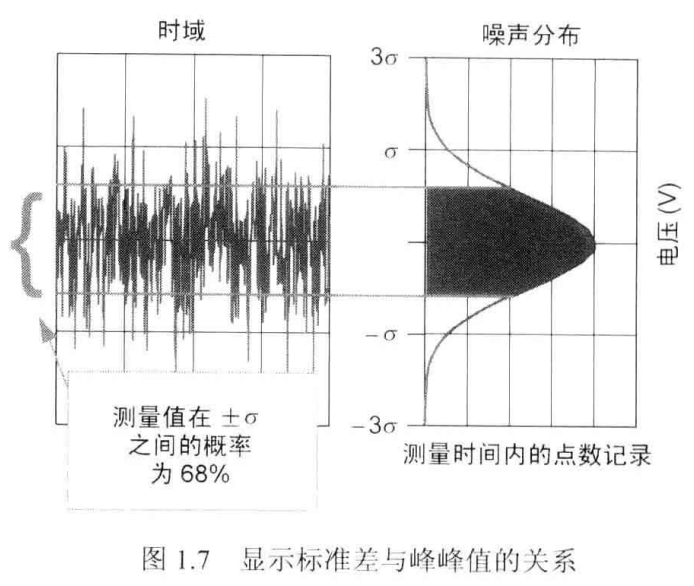

# 统计学导论及回顾

<!-- TOC -->

- [噪声的时域表示](#噪声的时域表示)
- [噪声的统计学表示](#噪声的统计学表示)
- [噪声的频域表示](#噪声的频域表示)
- [通过频谱密度计算均方根（RMS）噪声](#通过频谱密度计算均方根（RMS）噪声)
- [小结](#小结)
- [相关计算公式](#相关计算公式)
    
<!-- /TOC -->

---

## 噪声的时域表示

- 热噪声 en（RMS噪声电压）

    由导体中的电子自由运动产生，运动幅度随着温度上升而上升。

    正相关参数：
    

    R 以Ω为单位的电阻
               
    T 以K为单位的温度

    Δf 以Hz为单位的噪声带宽

---

## 噪声的统计学表示

- 概率密度函数

    描述正态分布。将一段时间间隔内测量到的噪声电压用柱状图绘制出来，其包络与这个函数近似。通过它可以得知每个事件对应的概率。

- 概率分布函数

    概率分布函数是概率密度函数的积分。通过它可以得知一个事件在已知区间内的发生概率。有助于将噪声的RMS转化为峰峰值。

---

## 噪声的频域表示

由频谱通常可看到运放噪声的两个区域

- 低频部分的1/f噪声

- 宽带区域的热噪声

---

## 通过频谱密度计算均方根（RMS）噪声

- 噪声功率频谱RMS=频谱密度积分

- 噪声电压（电流）频谱RMS=先转换为功率（V²、I²）再进行密度积分

---

## 小结

- 示波器测量是噪声的时域表示。
- x轴是时间，y轴是电压或者电流。
- 高斯分布是噪声的统计学表示。
- 如果噪声中不含DC成分（平均值为零），那么标准差等于RMS值。
- 6倍的标准差是峰峰值噪声的一个较好的近似。
- 噪声小于6倍标准差的概率是99.7%。
- 大部分噪声是不相关的。
- 不相关噪声之间的叠加是用每个噪声的平方和再开方来实现的。
- 噪声频谱密度是噪声的频域表示。
- 频谱密度的单位是V/HZ^1/2或A/HZ^1/2。
- 白噪声是由无限多相同能量不同频率的分量组成。
- 噪声频谱密度曲线的两个关键区域是1/f区域和宽带区域。
- 可以通过将噪声信号平方后积分，然后再开平方根的方式将噪声频谱密度转化为RMS噪声

---

## 相关计算公式

- 热噪声公式（RMS）en = (4*k*T*R*Δf)^1/2
- 频谱密度 en/(Δf^1/2) = (4*k*T*R)^1/2
- 相关噪声叠加：enT = （en1²+en2²+2*C*en1*en2）^1/2
- 不相关噪声叠加：enT = （en1²+en2²）^1/2

