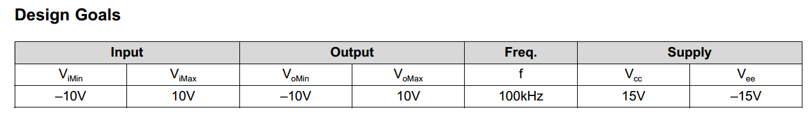
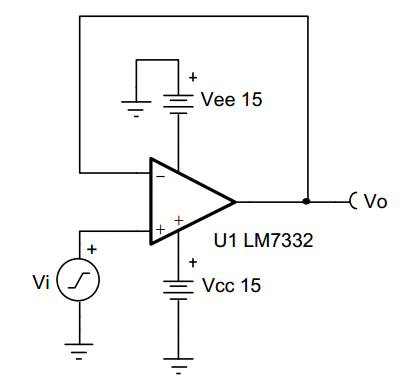
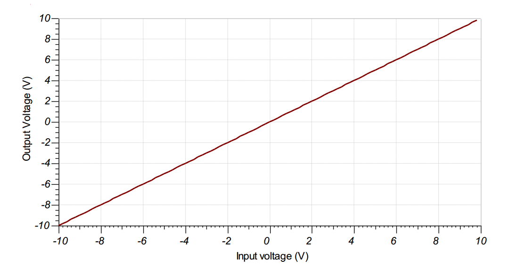
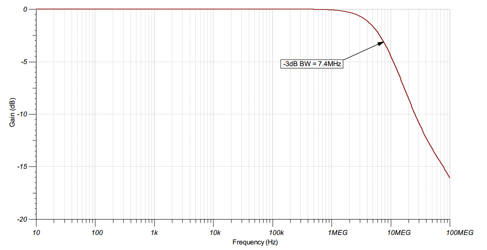

# 缓冲（跟随）电路

<!-- TOC -->

- [设计目标](#设计目标)
- [设计概述](#设计概述)
- [设计笔记](#设计笔记)
- [设计步骤](#设计步骤)
- [设计仿真](#设计仿真)
    - [DC设计指标](#DC设计指标)
    - [AC设计指标](#AC设计指标)
    
<!-- /TOC -->

---
## 设计目标

---

## 设计概述

- 此设计用于呈现高输入阻抗和低输出阻抗来缓冲信号。

- 此电路通常用于驱动低阻抗负载、ADC和缓冲器

- 此电路的输出电压等于输入电压

---

## 设计笔记

1. 工作在运放的线性输出工作范围

2. 小信号带宽由增益带宽积决定

3. 检查DATASHEET中最大输出电压范围和频率特性，减小失真

4. 共模电压等于输入信号

5. 请勿将大于建议值的电容放于输出

6. 如果要驱动低阻抗负载，可能需要高输出电流放大器

---

## 设计步骤

Vo = Vi

1. 使用提供的电源查看放大器的输出是否大于设计所需的设计范围

2. 查看产品数据表的输出电压和输出电流曲线，验证是否可实现所需输出电流的输出电压

3. 使用电源电压验证放大器的输入共模电压会不会超出范围。

4. 计算所需的最小压摆率（SR），查看运放是否大于该压摆率（弱运放压摆率太低则会引起失真）

5. 验证运放是否有足够的带宽。

---

## 设计仿真

### DC仿真结果

### AC仿真结果

