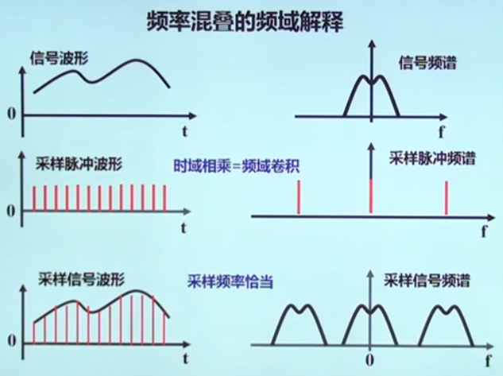
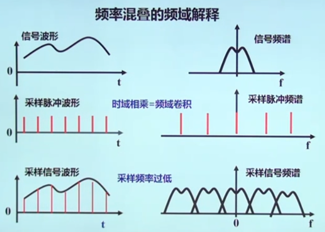
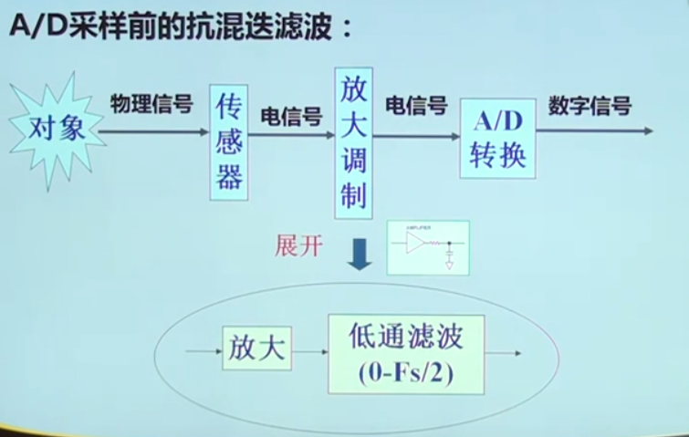

## A/D转换

- 积分型
- 逐次逼近型
- 并行比较型/串并行型等

### AD转换器位数和精度

1. A/D转换器位数和精度

- 8bit：0-255
- 10bit：0-1023
- 12bit：0-4096

2. A/D转换时间

- 1ms(1kHz)；10us(100kHz)

3. 电压输入范围

- 0-5V,0-10V,+-5V,+-10V

---

## D/A转换

1. D/A转换器位数和精度

- 8bit,10bit,12bit,16bit

2. D/A转换时间

- 1ms(1kHz);10us(100kHz)

3. 电压输出范围

- 0-5V，+-5V，0-10V，+-10V

---

## 采样定理

- 采样就是将连续的传感器模拟信号，通过A/D转换，转化为计算机能够分析的离散数字量。

- 采样就是将离散脉冲序列与信号相乘，取离散点值的过程。
--脉冲信号p(t) * 连续信号x(t)

### 采样密度

- 每周期至少需要两个点才能保证在恢复时保证最基本的周期信息

### 采样定理

- 为保证采样后信号能真实地保留原始模拟信号信息，信号采样频率必须至少为原信号中最高频率成分的2倍。这是采样的基本法则，称为采样定理。Fs>2Fmax

- 在工程领域，为保证采样信号的质量：Fs>5Fmax

### 采样过程中的频率混叠

- 频率混叠是采样频率不满足采样定理时，信号中的高频成分会被不正确的采样成低频成分。

60Hz正弦波信号，采样频率=100Hz，混叠频率=40Hz

### A/D采样前的抗混叠滤波（重要）

---

### 基于声卡的测试系统

- 实验：用声卡采集声音信号（A/D）e
